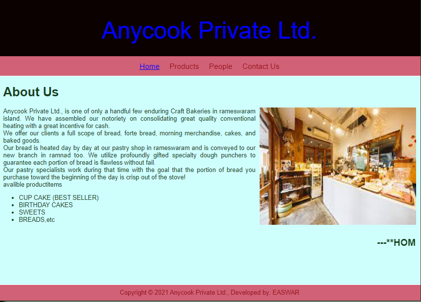

# AIM:
To design a static website for a software product company company.

# DESIGN STEPS:
## Step 1:
Requirement collection.

## Step 2:
Creating the layout using HTML and CSS.

## Step 3:
Updating the sample content.

## Step 4:
Choose the appropriate style and color scheme.

## Step 5:
Validate the layout in various browsers.

## Step 6:
Validate the HTML code.

## Step 7:
Publish the website in the given URL.

# PROGRAM :
## Layout:
Home Page:
<!DOCTYPE html>
<html lang="en">
  <head>
    <title>Anycook Private Ltd.</title>
    <link rel="stylesheet" href="./css/layout.css" />
    <link rel="icon" href="./img/icon.png" type="image/x-icon" />
  </head>

  <body>
    

      
Anycook Private Ltd.

      

        
<a href="/static/home.html">Home</a>

        
<a href="/static/products.html">Products</a>

        
<a href="/static/people.html">People</a>

        
<a href="/static/contactus.html">Contact Us</a>

      

      

        

          <h1>About Us</h1>
          
          

            Anycook Private Ltd., is one of only a handful few enduring Craft Bakeries in rameswaram
            island.
            We have assembled our notoriety on consolidating great quality conventional
            heating with a great incentive for cash.
             
            We offer our clients a full scope of bread, forte bread, morning merchandise,
            cakes, and baked goods.
             
            Our bread is heated day by day at our pastry shop in rameswaram and is conveyed
            to our new branch in ramnad too.
            We utilize profoundly gifted specialty dough punchers to guarantee each portion
            of bread is flawless without fail.
             
            Our pastry specialists work during that time with the goal that the portion of 
            bread you purchase toward the beginning of the day is crisp out of the stove!
             
            avalible productitems
            <ul>
              <li>CUP CAKE (BEST SELLER)</li>
              <li>BIRTHDAY CAKES</li>
              <li>SWEETS</li>
              <li>BREADS,etc</li>
            </ul>
            <marquee behavior="scroll" direction="left"><h2>---**HOME DELIVERY AVAILABLE**---</h2></marquee>
          

        

      

      

        Copyright &#169; 2021 Anycook Private Ltd., Developed by: EASWAR
      

    

  </body>
</html>
Products:
<!DOCTYPE html>
<html lang="en">
  <head>
    <title>Anycook Private Ltd.</title>
    <link rel="stylesheet" href="./css/layout.css" />
    <link rel="icon" href="./img/icon.png" type="image/x-icon" />
  </head>

  <body>
    

      

      

        
<a href="/static/home.html">Home</a>

        
<a href="/static/products.html">Products</a>

        
<a href="/static/people.html">People</a>

        
<a href="/static/contactus.html">Contact Us</a>

      

      

        
    
            <h1>Best chefs in the world</h1>
            

                
 
                    

                    
                    

                    
chef sanji

                    
Head chef

                

                
 
                    

                    
                    

                    
chef soma

                    
Head chef

                

                
 
                    

                    
                    

                    
chef gordan

                    
one of the best chef in the world

                

                
 
                    

                    
                    

                    
chef kunal

                    
senior chef

                

                
 
                    

                    
                    

                    
chef rinn

                    
working in bakery

                

                
 
                    

                    
                    

                    
chef jamo

                    
Assistant Baker

                

          

        

      

      

        Copyright &#169; 2021 Anycook Private Ltd., Developed by: EASWAR
      

    

  </body>
</html>
People:
<!DOCTYPE html>
<html lang="en">
  <head>
    <title>Anycook Private Ltd.</title>
    <link rel="stylesheet" href="./css/layout.css" />
    <link rel="icon" href="./img/icon.png" type="image/x-icon" />
  </head>

  <body>
    

      

      

        
<a href="/static/home.html">Home</a>

        
<a href="/static/products.html">Products</a>

        
<a href="/static/people.html">People</a>

        
<a href="/static/contactus.html">Contact Us</a>

      

      

        
    
            <h1>Best chefs in the world</h1>
            

                
 
                    

                    
                    

                    
chef sanji

                    
Head chef

                

                
 
                    

                    
                    

                    
chef soma

                    
Head chef

                

                
 
                    

                    
                    

                    
chef gordan

                    
one of the best chef in the world

                

                
 
                    

                    
                    

                    
chef kunal

                    
senior chef

                

                
 
                    

                    
                    

                    
chef rinn

                    
working in bakery

                

                
 
                    

                    
                    

                    
chef jamo

                    
Assistant Baker

                

          

        

      

      

        Copyright &#169; 2021 Anycook Private Ltd., Developed by: EASWAR
      

    

  </body>
</html>
Contact Us:
<!DOCTYPE html>
<html lang="en">
  <head>
    <title>Anycook Private Ltd.</title>
    <link rel="stylesheet" href="./css/layout.css" />
    <link rel="icon" href="./img/icon.png" type="image/x-icon" />
  </head>

  <body>
    

      

      

        
<a href="/static/home.html">Home</a>

        
<a href="/static/products.html">Products</a>

        
<a href="/static/people.html">People</a>

        
<a href="/static/contactus.html">Contact Us</a>

      

      

        
            <H1>Address:</H1> 
                No: 8, TG Road,   
                Vanagaran, Ayyampakkam road,  
                Anna Nagar,  
                Chennai - 600053 <br 
              Contact:8056663183;  
              E-mail:anycook2021@gmail.com 
               VERIFIED*
          </ul>    
        

    

    

    

      

        Copyright &#169; 2021 Anycook Private Ltd., Developed by: EASWAR
      

    

  </body>
</html>
OUTPUT:

### Home Page:

## Result:

Thus a website is designed for the software product company and the HTML,CSS code are validated.
